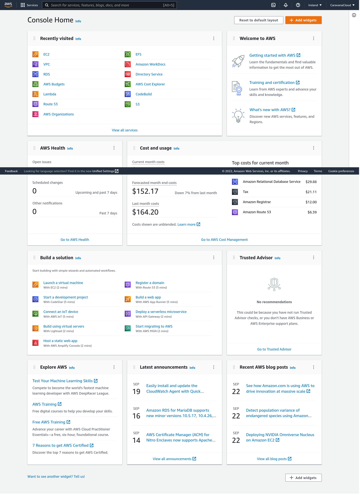
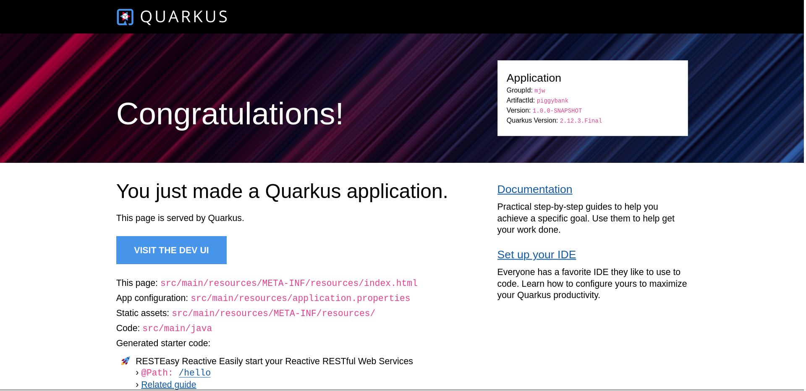

# Modern Java Workshop

Welcome!

In this workshop we'll practice building a sample application, using Amazon Web Services, Java and open-source technologies. In this context, "modern" means we'll explore beyond the traditional resources and techniques, including containers, serverless, machine learning, and more.

This self-paced workshop is open for anyone, requiring only a web browser and an AWS account. If you don't have an AWS account yet, you can create one for free at [https://aws.amazon.com/free/](https://aws.amazon.com/free/). However, it's helpful if you'd have some familiarity with running commands in terminal and with the Java programming language.  Don't worry though, we'll be commenting the code and commands as we go.


## Building Your "Piggybank"

The application you'll build is a simple "piggybank", allowing you to track and analyze your personal finance. The piggybank is intentionally simple, as the purpose of this workshop is to explore the different technologies and services available in AWS, not dive deep in Java development.  

## Fork this repo!

We recommend you fork this repository so that you can make changes to the code and commit them to your own repository.  This will allow you to easily track your progress and share your work with others.  You can fork this repository by clicking the "Fork" button in the upper right corner of this page.


## Soundcheck

Let's first make sure all tools are ready to go. 

### AWS Account

Please check that can log in to the AWS Management console at https://https://console.aws.amazon.com/



### Development Environment

Choose and access your development environment:

##### Cloud 9 (default)

AWS Cloud9 is a development environment you can use directly from your AWS account. Log in to your Cloud9 environment or create a new one at https://us-west-2.console.aws.amazon.com/cloud9/home

##### GitPod

GtiPod offers a web development environment based on Visual Studion Code. You can start a new GitPod environment for this repository at https://gitpod.io/#https://github.com/CaravanaCloud/modern-java-workshop or for your own fork at https://gitpod.io/#https://YOUR_FORK_URL

##### Local

You can also use your local computer if you prefer, just make sure you have installed the required tools.

### Java Virtual Machine

Make sure you have Java installed, at least version 11. You can check your Java version by running the following command:

```bash
java -version
```

The recommended Java Virtual Machine for this workshop is Amazon Corretto 11, which you can download and install from https://aws.amazon.com/corretto/ or using [SDKMan](httpsL//sdkman.io):
```bash
sdk install java 11.0.16-amzn
```

*Why Java 11, not 19?*

At the time of this writing, Amazon Lambda natively supports Java 11. We'll be using that version in all compute environments for simplicity. It's possible to use later versions by using containers or cross-compiling.

### Apache Maven

Make sure you have Apache Maven installed, at least version 3.6. You can check your Maven version by running the following command:

```bash
mvn -version
```

### AWS Command Line Interface

The AWS Command Line Interface (CLI) is a unified tool to manage your AWS services. You should have the AWS CLI installed already, or proceed to install it following the instructions at https://docs.aws.amazon.com/cli/latest/userguide/install-cliv2.html

```bash
aws --version
```

### AWS SAM CLI

The AWS Serverless Application Model (SAM) is an open-source framework for building serverless applications. You should have the AWS SAM CLI installed already, or proceed to install it following the instructions at https://docs.aws.amazon.com/serverless-application-model/latest/developerguide/serverless-sam-cli-install.html

```bash
sam --version
```
### Quarkus

We'll be using the [Quarkus Command Line Interface](https://quarkus.io/guides/cli-tooling) to create and manage projects. Check that it is properly installed by running the following command:

```bash
quarkus --version
```

Quarkus References:
* All config options: https://quarkus.io/guides/all-config
* Quarkus cheat sheet: https://lordofthejars.github.io/quarkus-cheat-sheet/


In this workshop, Quarkus is used as a reference implementation. If you'd prefer, feel free to adapt and use any other framework, such as Spring Boot, Micronaut, JHipster or even plain Java.

### Done!


Awesome! You're ready to go!

## Task 1: Project Setup

Let's create a new project named "piggybank" (artifactId), in the "mjw" group, using Java 11 as the language and Apache Maven as the build tool. 

```bash
quarkus create app --java=11 --maven mjw:piggybank
```

Start the application in development mode, using the [maven wrapper](https://www.baeldung.com/maven-wrapper):
```bash
cd piggybank
./mvnw quarkus:dev
```
Quarkus development mode will run in this terminal, in the foreground, accepting commands and restarting the application automatically as you change it.

In a new terminal, "visit" you application at http://localhost:8080
```bash
curl http://localhost:8080
```
On C9: Preview > Preview running applciation
On GitPod: Click the link or visit the port URL



Also, test the [JAX-RS resource class](https://www.baeldung.com/jax-rs-spec-and-implementations) that was generated in `src/main/java/org/acme/piggybank/PiggybankResource.java`:

```bash
curl -v http://localhost:8080/hello
```

Generate an application package:
```bash
./mvnw package
```

Check the generated package size and structure:
```
du -h target/quarkus-app/
```

Run the application package (production profile):
```bash
java -jar target/quarkus-app/quarkus-run.jar
```

## Task 2: Adding a Local Database

Let's add a MySQL relational database to our application, first locally then using AWS Services. 

### Java Database Connectivity (JDBC) and Local MySQL

In Quarkus, we add features as extensions. Let's add the [Agroal](https://quarkus.io/guides/datasource) extension for datasource management (including connection pooling) and the MySQL JDBC driver and tools.
```
quarkus ext add agroal jdbc-mysql
```

Let's add a simple "health check" class that only connects to the database and verify that it's running and reachable:

Add the following code to `src/main/java/mjw/HealthCheckResource.java`
```java
package mjw;

import java.sql.SQLException;

import javax.inject.*;
import javax.sql.*;
import javax.ws.rs.*;
import javax.ws.rs.core.MediaType;

@Path("/_hc")
public class HealthCheckResource {
private static final int DB_CONN_TIMEOUT_SEC = 10;

    @Inject
    DataSource ds;

    @GET
    @Produces(MediaType.TEXT_PLAIN)
    public String healthCheck() {
        try (var conn = ds.getConnection()){
            conn.isValid(DB_CONN_TIMEOUT_SEC);
        }catch(SQLException ex){
            throw new WebApplicationException("Could not connect to database", 500);
        } 
        return "Application is healthy";
    }
}
```
Terminate (ctrl+c) and re-start your application.

Check that the database is up and reachable:
```bash
curl -v http://localhost:8080/_hc
```

*Where is that database?*
[Quarkus Dev Services](https://quarkus.io/guides/datasource#dev-services) will automatically start a MySQL database in a Docker container, and configure the application to use it in development mode.  

### Connecting to a Remote database
You can also connect to the remote database created for this workshop for testing purposes. However, be aware that this database is shared and read-only.
```bash 
mysql -upiggyuser -p"AuraLabs321!" -hlabs-db.cwcl66gp21cx.us-west-2.rds.amazonaws.com piggybankdb
```

There are many ways you can [configure your application](https://quarkus.io/guides/config). Let's use the default properties file `src/main/resources/application.properties` to change and test the database connection:

```properties
aurora.endpoint=labs-db.cwcl66gp21cx.us-west-2.rds.amazonaws.com
quarkus.datasource.db-kind=mysql
quarkus.datasource.jdbc.url=jdbc:mysql://${aurora.endpoint}:3306/piggybankdb
quarkus.datasource.username=piggyuser
quarkus.datasource.password=AuraLabs321!
```

Check that your application is working:
```bash
curl http://localhost:8080/_hc
```

You can also check the network connection to the database:
```bash
netstat -anp | grep :3306
```

## Task 2: Going Serverless

So far, we have been using the traditional "server" model. You can run the application package in any server just like we did in task 1. However, using AWS Lambda, and other services in the "serverless" category, we can:
* Improve scalability, performance and security
* Reduce waste, allocating resource on-demand
* Reduce cost, even scaling down to zero

However, for most developers, it's not practical to build functions directly in the AWS Console. We'll use our choice of IDE and the [AWS Serverless Application Model (SAM)](https://aws.amazon.com/serverless/sam/) to define our application, and the AWS SAM CLI to build and deploy it.

In this task, we'll change the application configuration and tooling to use AWS Lambda and AWS SAM, instead of the "server" model we used in task 1. It's also posible to keep the "server" project as is and build a separate "serverless" project.  

Add the [lambda-http extension](https://quarkus.io/guides/amazon-lambda):
```bash
quarkus ext add amazon-lambda-http
```
Re-build the application package:
```bash
mvn clean package
```
Check the new package structure. You should see a `function.zip` file containing the compiled function code, along with the `sam.jvm.yaml` template file.
```bash
ls target
```
The `sam.jvm.yaml` template file declares the infrastructure resources that are going to be provisioned, as code.

```yaml
# ...
Resources:
  Piggybank:
    Type: AWS::Serverless::Function
# ...
```

Use the sam deploy to deploy the generated function to AWS Lambda, using the guided configuration:
```bash
sam deploy -t target/sam.jvm.yaml -g
```
You can proceed with default settings for all options, except for "Piggybank may not have authorization defined, Is this okay?", which must be explicitly answered "y".

Let's use the AWS CLI to fetch de generated HTTP API endpoint:
```bash
API_URL=$(aws cloudformation describe-stacks --query 'Stacks[0].Outputs[?OutputKey==`PiggybankApi`].OutputValue' --output text)
echo $API_URL
```
Check the application resources:
```bash
curl "${API_URL}"
curl "${API_URL}/hello"
curl "${API_URL}/_hc"
```
Check the [AWS Console](https://console.aws.amazon.com/lambda/home) for more information about the deployed function and other resources. 


## Task 3: Your Own Serverless Database

So far, we've been using a local or shared database. Now, let's provision our own database in AWS, and connect our application to it.

In this tutorial we'll use Amazon Aurora Serverless, a fully managed, auto-scaling relational database. It's a good choice for applications that have unpredictable workloads, and need to scale up and down to zero. Also, we'll create the database using the AWS CloudFormation template, so we can easily tear it down when we're done.

Take a few minutes to review the [database CloudFormation template](./cloudformation/database.template.yaml). Some points to note:
* What resources are created?
* How are parameters passed?
* How are outputs returned?

After reviewing the template, create a stack from it using the AWS CLI:
```bash
aws cloudformation create-stack \
  --stack-name "database-stack" \
  --template-body file://./cloudformation/database.template.yaml \
  --query 'StackId' \
  --output text
```

Wait until the stack status is CRATE_COMPLETE:
```
watch aws cloudformation describe-stacks --stack-name  "database-stack" --query 'Stacks[0].StackStatus'
```
While you wait, it might be a good time to take a look into the [Using Amazon Aurora Serverless v1](https://docs.aws.amazon.com/AmazonRDS/latest/AuroraUserGuide/aurora-serverless.html) documentation page. One important limitation is that you can't connect to Aurora Serverless V1 from outside of a VPC, like we did previously using the `mysql` command line. To connect to this database, use the [Amazon RDS Query Editor](https://console.aws.amazon.com/rds/home#query-editor:).

After the database stack is successfully created, let's configure the application to use it and move move the lambda function to the generated VPC, so that our lambda functions can access the database privately.

To connect to the new database endpoint, let's fetch the address and re-generate the `application.properties` file, pointing to the new database endpoint.
```bash
export DB_ENDPOINT=$(aws cloudformation describe-stacks --stack-name  "database-stack" --query "Stacks[0].Outputs[?OutputKey=='DbEndpoint'].OutputValue" --output text)
echo "DB_ENDPOINT=DB_ENDPOINT"
envsubst < application.tpl.properties > ./piggybank/src/main/resources/application.properties
cat ./piggybank/src/main/resources/application.properties
```
Using the default `application.properties` like this is a simple way to configure your application, but we can also use profiles, environment variables and many other configuration sources supported by Quarkus.


First, fetch the subnet and security group IDs from the database stack:
```bash 
export SUBNET0=$(aws cloudformation describe-stacks --stack-name "database-stack" --query "Stacks[0].Outputs[?OutputKey=='PrivateSubnet0'].OutputValue" --output text) 
echo "SUBNET0=$SUBNET0"

export SUBNET1=$(aws cloudformation describe-stacks --stack-name  "database-stack" --query "Stacks[0].Outputs[?OutputKey=='PrivateSubnet1'].OutputValue" --output text)
echo "SUBNET1=$SUBNET1"

export SUBNET2=$(aws cloudformation describe-stacks --stack-name  "database-stack" --query "Stacks[0].Outputs[?OutputKey=='PrivateSubnet2'].OutputValue" --output text)
echo "SUBNET2=$SUBNET2"

export SECGRP=$(aws cloudformation describe-stacks --stack-name  "database-stack" --query "Stacks[0].Outputs[?OutputKey=='PiggybankRDSSecurityGroup'].OutputValue" --output text)
echo "SECGRP=$SECGRP"
```
If you open another terminal session, remember to export the variables again.

Review the `sam.tpl.yaml` "template template" :)
Now let's replace the placeholders in the template with the actual values using the [envsubst](https://www.baeldung.com/linux/envsubst-command) command. If needed, you can install `envsubst` by installing the `gettext` package. If by any reason that does not work, replacing the variables manually would work just as well.

```bash
envsubst < sam.tpl.yaml > template.yaml
cat template.yaml
```

Re-build and re-deploy the application:
```bash
mvn -f piggybank package
sam deploy
```

## Task 4: Continuous Delivery

Now that we have a working application, let's set up a continuous delivery pipeline to automatically deploy changes to the application.

```bash
```


## Task 5: S3 Ingest Function
```bash
mvn -B archetype:generate \
       -DarchetypeGroupId=io.quarkus \
       -DarchetypeArtifactId=quarkus-amazon-lambda-archetype \
       -DarchetypeVersion=2.13.0.Final \
       -DgroupId=mjw \
       -DartifactId=piggybank-ingest \
       -Dversion=1.0.0-SNAPSHOT 
cd piggybank-ingest
```

```java
package mjw;

import java.io.*;
import java.math.*;
import java.sql.*;
import javax.sql.*;
import javax.inject.*;

import com.amazonaws.services.lambda.runtime.*;
import com.amazonaws.services.lambda.runtime.events.S3Event;
import com.amazonaws.services.lambda.runtime.events.models.s3.S3EventNotification;

import software.amazon.awssdk.core.ResponseInputStream;
import software.amazon.awssdk.regions.Region;
import software.amazon.awssdk.services.s3.S3Client;
import software.amazon.awssdk.services.s3.model.GetObjectRequest;
import software.amazon.awssdk.services.s3.model.GetObjectResponse;


@Named("s3-ingest")
public class S3IngestFunction implements RequestHandler<S3Event, Void> {
    private static final String insertSQL = "INSERT INTO Entries (entryTime, amount, category, description) VALUES (?, ?, ?, ?)";
    private static final String createTableSQL = "CREATE TABLE IF NOT EXISTS Entries (id int not null primary key auto_increment, entryTime  timestamp, amount decimal(10,2), category varchar(255), description varchar(255));";

    @Inject
    DataSource ds;

    @Override
    public Void handleRequest(S3Event event, Context context) {
        debug(event, context);
        event.getRecords().stream()
                .forEach(r -> handleRecord(context, r));
        return null;
    }

    private void handleRecord(Context context, S3EventNotification.S3EventNotificationRecord record){
        var log = context.getLogger();
        var responseInputStream = getObjectAsStream(record);
        var reader = new BufferedReader(new InputStreamReader(responseInputStream));
        var lines = reader.lines();
        lines.forEach(line -> insertLine(context, line, false));
        log(context, "done handling records ");
    }

    private ResponseInputStream<GetObjectResponse> getObjectAsStream(S3EventNotification.S3EventNotificationRecord record) {
        var s3Entity = record.getS3();
        var region = record.getAwsRegion();
        var bucketRec = s3Entity.getBucket();
        var objectRec = s3Entity.getObject();
        var bucketName = bucketRec.getName();
        var key = objectRec.getKey();
        var s3 = S3Client.builder().region(Region.of(region)).build();
        var req = GetObjectRequest.builder()
                .bucket(bucketName)
                .key(key)
                .build();
        var obj = s3.getObject(req);
        return obj;
    }

    private void debug(S3Event event, Context context) {
        log(context,"ENVIRONMENT VARIABLES: " + System.getenv());
        log(context,"CONTEXT: " + context);
        log(context,"EVENT: " + event);
    }

    private void log(Context context, String... args) {
        var logger = context.getLogger();
        logger.log(String.join(" ", args));
    }

    private void insertLine(Context context, String line, boolean retry) {
        log(context,"Inserting line: " + line);
        try (var conn = ds.getConnection();
             var stmt = conn.prepareStatement(insertSQL)){
            parseLine(line, stmt);
            stmt.executeUpdate();
            log(context,"Inserted entry: " + line);
        }catch(SQLException e){
            if (e instanceof SQLSyntaxErrorException ) {
                if (! retry) {
                    createTable(context);
                    insertLine(context, line, true);
                }else {
                    log(context,"Failed to insert line: ", line, e.getMessage());
                    e.printStackTrace();
                }
            }
        }
    }

    private void parseLine(String line, PreparedStatement stmt)
            throws SQLException {
        var entry = line.split(",");
        var entryTime = Timestamp.valueOf(entry[0]);
        var entryAmount = new BigDecimal(entry[1]);
        var entryCategory = entry[2];
        var entryDescription = entry[3];
        stmt.setTimestamp(1, entryTime);
        stmt.setBigDecimal(2, entryAmount);
        stmt.setString(3, entryCategory);
        stmt.setString(4, entryDescription);
    }

    private void createTable(Context context) {
        log(context,"Creating entries table");
        try (var conn = ds.getConnection();
             var stmt = conn.createStatement()){
            stmt.execute(createTableSQL);
            log(context,"Created table");
        }catch(SQLException e){
            log(context,"Failed to create table: " + e.getMessage());
            throw new RuntimeException(e);
        }
    }
}
```

Notice the S3 event in the SAM template `sam-s3.tpl.yaml`:
```yaml
Events:
  S3Event:
    Type: S3
    Properties:
      Bucket: !Ref IngestBucket
      Events:
        - 's3:ObjectCreated:*'
```

Build the function package and the template file:
```bash
mvn -f piggybank-ingest package
envsubst < sam-s3.tpl.yaml > template-s3.yaml
cat template-s3.yaml
```

Deplouy to AWS using the SAM CLI:
```bash
sam deploy -t template-s3.yaml -g
```

Get the name of the created bucket:
```bash
export INGEST_BUCKET=$(aws cloudformation describe-stacks --stack-name  "piggybank-s3" --query "Stacks[0].Outputs[?OutputKey=='IngestBucketName'].OutputValue" --output text)
echo "INGEST_BUCKET=$INGEST_BUCKET"
```

Copy a sample entries CSV file to the S3 bucket:
```bash
aws s3 cp ./sample-data/sample-entries.csv s3://${INGEST_BUCKET}/$RANDOM.csv
```

Check the database to see if the entries were inserted, using the RDS [Query Editor](https://console.aws.amazon.com/rds/home#query-editor:)

# Thank you!

We hope you enjoyed this workshop and use it as a foundation to build you own application using AWS, Java and Quarkus. There's a lot more to explore in the hundreds of services offered by AWS and open-source technologies. See you in the next workshop!
